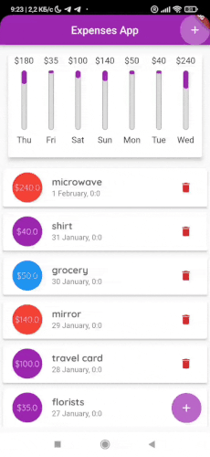
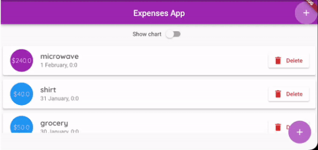

# Expenses App

The app allows user to create and track his expenses. 
The user can specify the title, amount and date of the expense.
The chart bar at the top of the screen displays spending in each day for the last 7 days relative to the total amount spent.
___
## Technical description

Flutter 3.3.10 • Dart 2.18.6

`flutter_bloc 8.1.1` library is used for implementing BLoC pattern.

A landscape mode with a special ratio of widget sizes is provided.
___

*NOTE* since this project is a pet project, cases of overengineering are possible

